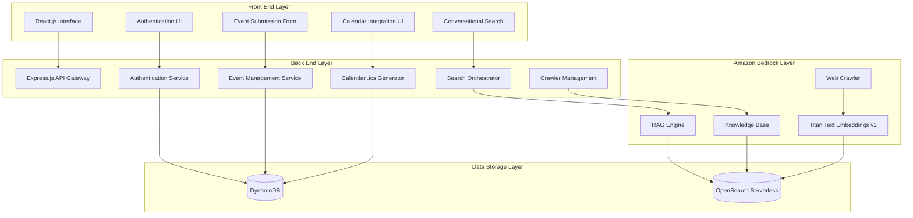

# EventSync Platform Design Document

## Overview

EventSync is a four-layer architecture platform that combines AI-powered event discovery with seamless calendar integration. The system leverages Amazon Bedrock for conversational search, DynamoDB for user data, OpenSearch Serverless for semantic search, and generates standard .ics calendar files for universal calendar compatibility.

## Architecture

### System Architecture Diagram



### Layer Responsibilities

**Front End Layer (React.js/Next.js)**
- Responsive web interface for all user interactions
- Real-time conversational AI search interface
- Calendar integration UI with .ics download capabilities
- Event submission and management forms
- User authentication and profile management

**Back End Layer (Node.js + Express.js)**
- RESTful API gateway with HTTPS security
- Authentication orchestration (DynamoDB/AWS Cognito)
- Event data aggregation and filtering
- .ics file generation and serving
- Amazon Bedrock API integration
- Web crawler management and monitoring

**Data Storage Layer**
- DynamoDB: User profiles, preferences, saved events, user-submitted events
- OpenSearch Serverless: Vectorized event data for semantic search

**Amazon Bedrock Layer**
- Knowledge Base: Web crawler data source management
- RAG Engine: Natural language query processing
- Embeddings: Semantic vector generation
- Web Crawler: Automated event discovery and indexing

## Components and Interfaces

### Front End Components

#### Authentication Component
```typescript
interface AuthComponent {
  login(credentials: UserCredentials): Promise<AuthResult>
  register(userData: UserRegistration): Promise<AuthResult>
  logout(): void
  getCurrentUser(): User | null
}
```

#### Event Search Component
```typescript
interface EventSearchComponent {
  searchEvents(query: string, filters?: SearchFilters): Promise<Event[]>
  getPersonalizedFeed(userId: string): Promise<Event[]>
  saveEvent(eventId: string, userId: string): Promise<void>
  generateCalendarLink(event: Event): string
}
```

#### Calendar Integration Component
```typescript
interface CalendarIntegrationComponent {
  generateICSFile(event: Event): string
  downloadICSFile(event: Event): void
  getCalendarLink(event: Event): string
}
```

### Back End Services

#### Authentication Service
```typescript
interface AuthenticationService {
  authenticateUser(credentials: UserCredentials): Promise<AuthToken>
  createUser(userData: UserRegistration): Promise<User>
  validateToken(token: string): Promise<boolean>
  refreshToken(token: string): Promise<AuthToken>
}
```

#### Event Management Service
```typescript
interface EventManagementService {
  createEvent(eventData: EventSubmission, userId: string): Promise<Event>
  updateEvent(eventId: string, eventData: Partial<Event>, userId: string): Promise<Event>
  deleteEvent(eventId: string, userId: string): Promise<void>
  getUserEvents(userId: string): Promise<Event[]>
  validateEventData(eventData: EventSubmission): ValidationResult
}
```

#### Search Service
```typescript
interface SearchService {
  performSemanticSearch(query: string, filters?: SearchFilters): Promise<Event[]>
  getPersonalizedRecommendations(userId: string): Promise<Event[]>
  indexUserSubmittedEvent(event: Event): Promise<void>
}
```

#### Calendar Service
```typescript
interface CalendarService {
  generateICSContent(event: Event): string
  validateICSFormat(icsContent: string): boolean
  serveICSFile(event: Event): Response
}
```

### External API Interfaces

#### Amazon Bedrock Integration
```typescript
interface BedrockService {
  queryKnowledgeBase(query: string): Promise<RAGResponse>
  indexDocument(document: EventDocument): Promise<void>
  getEmbeddings(text: string): Promise<number[]>
  manageCrawler(action: CrawlerAction): Promise<CrawlerStatus>
}
```

## Data Models

### User Model
```typescript
interface User {
  userId: string
  email: string
  passwordHash: string
  profile: UserProfile
  preferences: UserPreferences
  savedEvents: string[]
  createdAt: Date
  updatedAt: Date
}

interface UserProfile {
  firstName: string
  lastName: string
  location?: Location
  interests: string[]
  timezone: string
}

interface UserPreferences {
  eventCategories: string[]
  maxDistance: number
  priceRange: PriceRange
  notificationSettings: NotificationSettings
}
```

### Event Model
```typescript
interface Event {
  eventId: string
  title: string
  description: string
  startDateTime: Date
  endDateTime: Date
  location: Location
  organizer: Organizer
  category: string
  price: Price
  tags: string[]
  source: EventSource
  createdBy?: string
  createdAt: Date
  updatedAt: Date
}

interface Location {
  venue: string
  address: string
  city: string
  state: string
  zipCode: string
  coordinates: Coordinates
}

interface Organizer {
  name: string
  email?: string
  website?: string
  phone?: string
}
```

### Search Models
```typescript
interface SearchFilters {
  dateRange?: DateRange
  location?: LocationFilter
  categories?: string[]
  priceRange?: PriceRange
  distance?: number
}

interface RAGResponse {
  events: Event[]
  relevanceScores: number[]
  totalResults: number
  query: string
}
```

## Error Handling

### Error Types and Responses

#### Authentication Errors
- `INVALID_CREDENTIALS`: 401 - Invalid username/password
- `TOKEN_EXPIRED`: 401 - Authentication token expired
- `ACCOUNT_LOCKED`: 423 - Account temporarily locked
- `REGISTRATION_FAILED`: 400 - Invalid registration data

#### Event Management Errors
- `EVENT_NOT_FOUND`: 404 - Requested event does not exist
- `UNAUTHORIZED_ACCESS`: 403 - User cannot modify this event
- `INVALID_EVENT_DATA`: 400 - Event data validation failed
- `SUBMISSION_LIMIT_EXCEEDED`: 429 - Too many event submissions

#### Search and AI Errors
- `SEARCH_SERVICE_UNAVAILABLE`: 503 - Bedrock service temporarily unavailable
- `INVALID_QUERY`: 400 - Malformed search query
- `RATE_LIMIT_EXCEEDED`: 429 - Too many search requests

#### Calendar Integration Errors
- `ICS_GENERATION_FAILED`: 500 - Failed to generate calendar file
- `INVALID_EVENT_FORMAT`: 400 - Event data incompatible with calendar format

### Error Handling Strategy

```typescript
interface ErrorHandler {
  handleAuthenticationError(error: AuthError): ErrorResponse
  handleEventManagementError(error: EventError): ErrorResponse
  handleSearchError(error: SearchError): ErrorResponse
  handleCalendarError(error: CalendarError): ErrorResponse
  logError(error: Error, context: ErrorContext): void
}
```

### Retry and Fallback Mechanisms
- Bedrock API calls: 3 retries with exponential backoff
- DynamoDB operations: 2 retries with jitter
- OpenSearch queries: 2 retries with circuit breaker
- Web crawler failures: Automatic retry with CloudWatch alerting

## Testing Strategy

### Unit Testing
- **Authentication Service**: Test credential validation, token generation, user creation
- **Event Management**: Test CRUD operations, validation logic, user permissions
- **Search Service**: Test query processing, result ranking, filter application
- **Calendar Service**: Test .ics generation, format validation, RFC 5545 compliance

### Integration Testing
- **API Endpoints**: Test complete request/response cycles for all endpoints
- **Database Operations**: Test DynamoDB and OpenSearch integration
- **Bedrock Integration**: Test RAG queries, embedding generation, crawler management
- **Calendar Integration**: Test .ics file generation and download functionality

### End-to-End Testing
- **User Registration Flow**: Complete user signup and authentication process
- **Event Discovery Flow**: Search, filter, and save events workflow
- **Calendar Integration Flow**: Event selection to calendar addition process
- **Event Submission Flow**: User event creation and publication workflow

### Performance Testing
- **Search Response Time**: Target <2 seconds for semantic search queries
- **Calendar File Generation**: Target <500ms for .ics file creation
- **Concurrent User Load**: Support 1000+ concurrent users
- **Database Query Performance**: Monitor DynamoDB and OpenSearch response times

### Security Testing
- **Authentication Security**: Test token validation, session management
- **Input Validation**: Test SQL injection, XSS prevention
- **API Security**: Test rate limiting, HTTPS enforcement
- **Data Privacy**: Test user data encryption and access controls

### Monitoring and Observability
- **CloudWatch Integration**: Monitor crawler operations, API performance, error rates
- **Application Metrics**: Track user engagement, search success rates, calendar downloads
- **Health Checks**: Automated monitoring of all service endpoints
- **Alerting**: Real-time notifications for service failures and performance degradation